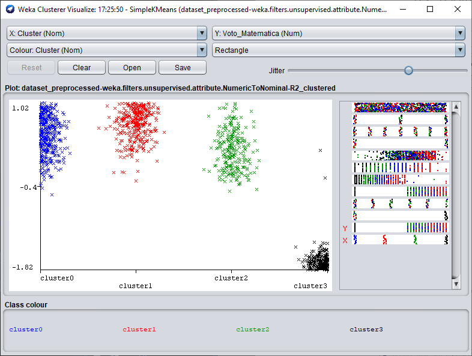
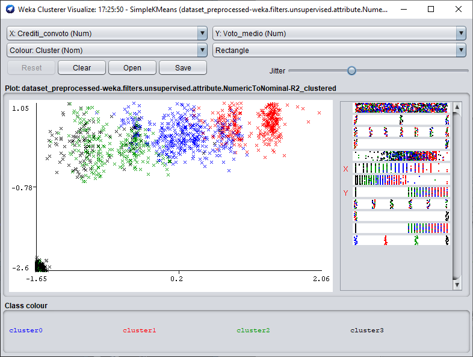

```{r setup, include=FALSE}
knitr::opts_chunk$set(echo = TRUE)
library(dplyr)
library(gridExtra) 
library(cluster) 
library(factoextra)
```

## Introduzione

Il progetto da me scelto comprende il dataset "Coorti 2010- 2016 studenti di tre CdS Scuola SMFN - produttivita I anno + esame di matematica" e prevede l'applicazione di algoritmi di clustering per analizzare i dati proposti.

Il dataset si presenta in questo modo:

```{r}
dataset = read.csv("./Data/dataset.csv")
summary(dataset)
```

Per ogni studente abbiamo quindi le seguenti informazioni:

* Corso di Laurea, con 3 possibili opzioni
* Coorte di iscrizione, dal 2010 al 2016 compresi
* Il genere
* Il voto del test d'ingresso obbligatorio per gli studenti iscritto alla scuola di SMFN. 
* Crediti che corrispondono ad esami con attribuzione di voto
* Crediti che corrispondono ad esami con o senza attribuzione di voto
* Il voto medio che lo studente ha ottenuto negli esami da esso superati
* La scuola di provenienza prima dell'iscrizione all'Università
* Se lo studente ha superato o meno l'esame di Analisi I o Matematica I al primo anno
* Il voto conseguito al suddetto esame
* Il numero di crediti conseguiti con il superamento del medesimo esame

## Preprocessing con R

Prima di poter applicare i classici algoritmi di clustering, è necessario preparare i dati per modificarne alcune caratteristiche senza alterare od eliminare alcuna informazione contenuta nel dataset.

La colonna ```Scuola_provenienza``` presenta valori ricondicibili alla seguente legenda:

* LS = Liceo Scientifico
* LC = Liceo Classico
* IT = Istituto Tecnico Industriale
* TC = Istituto Tecnico Commerciale
* IP = Istituto Professionale
* AL, IA, IPC, LL, XX, o cella vuota = Altro

ed è quindi necessario modificare il dato per far sì che questo sia rappresentato nel dataset:

```{r}
summary(dataset$Scuola_provenienza)

dataset$Scuola_provenienza = as.character(dataset$Scuola_provenienza)
dataset$Scuola_provenienza = with(dataset,
                                  ifelse(
                                    Scuola_provenienza %in% 
                                    c('AL', 'IA', 'IPC', 'LL', 'XX', ''),
                                    'Altro',
                                    Scuola_provenienza
                                  ))

dataset$Scuola_provenienza = as.factor(dataset$Scuola_provenienza)
summary(dataset$Scuola_provenienza)
```

La prossima colonna da analizzare è ```Esame_matematica```.
```{r}
summary(dataset$Esame_Matematica)
```
Questa colonna ci da un'informazione molto importante: se lo studente ha superato o meno l'esame di profitto di Analisi I o Matematica I al primo anno. Una cella vuota sta a significare che lo studente non ha superato l'esame. Dobbiamo quindi modificare il dato per meglio spiegare questo fenomeno, ignorando il nome dell'esame poiché non è di nostro interesse al momento.
```{r}
dataset$Esame_Matematica = as.character(dataset$Esame_Matematica)
dataset$Esame_Matematica = with(dataset,
                                ifelse(Esame_Matematica %in% (''), 
                                'Non superato', Esame_Matematica))
dataset$Esame_Matematica = with(dataset,
                                ifelse(Esame_Matematica %in% ('MATEMATICA I'),
                                'EsameMatematica', Esame_Matematica))
dataset$Esame_Matematica = as.factor(dataset$Esame_Matematica)
summary(dataset$Esame_Matematica)
```
Un attributo direttamente legato al precedente è ```Voto_Matematica```. 
```{r}
summary(dataset$Voto_Matematica)
```
Come mostrato, questo attributo presenta valori pari a zero e valori nulli. I valori pari a zero sono interpretabili come informazione non presente nel dataset, mentre i valori nulli corrispondono agli studenti che non hanno superato l'esame di matematica.
L'informazione mancante non può essere esclusa, considereremo quindi la media dei voti dello studente come valore attendibile per ```Voto_Matematica```.
```{r}
dataset$Voto_Matematica = with(dataset, ifelse(Voto_Matematica %in% (0), 
                                               Voto_medio, Voto_Matematica))
dataset$Voto_Matematica = with(dataset, ifelse(Esame_Matematica %in% ('Non superato'), 
                                               0, Voto_Matematica))
summary(dataset$Voto_Matematica)

```
In questo modo abbiamo mantenuto le informazioni intatte all'interno del nostro dataset, in qualche modo inferendo quelle mancanti, e modificato il significato di un valore dell'attributo ```Voto_Matematica```: adesso il lo zero corrisponde agli studenti che non hanno superato l'esame di matematica.

```{r, echo=FALSE, fig.align = "center", dpi=400, fig.width=4, fig.height=3}
hist(dataset$Voto_Matematica, xlab = 'Voto', ylab = 'Frequenza', main = 'Valori di Voto_Matematica')
```

Uno degli attributi più importanti di questo dataset è ```Voto_test``` che indica il voto conseguito da uno studente per il test di ingresso al Corso di Laurea a cui si è iscritto. L'attribuzione del voto è stata modificata negli anni, in particolare: negli anni 2010-2015, il test era costituito da un questionario con 25 domande e ogni risposta corretta era valutata 1, ogni risposta sbagliata o non data era valutata 0; il test risultava superato con un punteggio >=12. Dal 2016, invece, il test  e' costituito da un questionario con 20 domande: ogni risposta corretta viene valutata 1, ogni risposta sbagliata viene valutata -0.25 e ogni risposta non data 0; il test risulta superato con punteggio >=8.
E' quindi presente, a seconda dell'anno preso in considerazione, un diverso range di valori con attributi diversi che dovrebbero in realtà avere lo stesso significato, come per esempio 8 e 12 per il superamento del test.
Possiamo dunque applicare una tecnica di standardizzazione che riconduce un qualunque attributo $v$ con media $\mu$ e varianza $\sigma^2$ ad una variabile $v'$ con media $\mu=0$ e varianza $\sigma^2=1$, ossia con distribuzione standard.
Definendo $\mu_0,\mu_1\dots,\mu_6$ come la media dei valori dell'attributo e $\sigma_0,\sigma_1\dots,\sigma_6$ la sua deviazione standard rispettivamente per gli anni $2010, 2011, \dots, 2016$, il nuovo valore è cacolato come:
\begin{center}
$v'=\frac{v-\mu_i}{\sigma_i}$
\end{center}
attraverso la funzione ```scale```.
```{r}
summary(dataset$Voto_test)
sd(dataset$Voto_test)
```
```{r}
rescale_to_01 <- function(dataset, anno) {
  subset_data = subset(dataset, dataset$Coorte == anno)
  subset_data$Voto_test = scale(subset_data$Voto_test)
  return(subset_data)
}
```
```{r, echo=FALSE}
Voto_test_old <- dataset$Voto_test
subset2010 = rescale_to_01(dataset, 2010)
subset2011 = rescale_to_01(dataset, 2011)
subset2012 = rescale_to_01(dataset, 2012)
subset2013 = rescale_to_01(dataset, 2013)
subset2014 = rescale_to_01(dataset, 2014)
subset2015 = rescale_to_01(dataset, 2015)
subset2016 = rescale_to_01(dataset, 2016)
dataset = plyr::rbind.fill(subset2010,
                           subset2011,
                           subset2012,
                           subset2013,
                           subset2014,
                           subset2015,
                           subset2016)
```
```{r}
summary(dataset$Voto_test)
sd(subset(dataset, dataset$Coorte == 2010)$Voto_test)
```
```{r, echo=FALSE, fig.align = "center", dpi=400, fig.width=10, fig.height=4}
par(mfrow=c(1,2))
hist(Voto_test_old, xlab = 'Voto test d\'ingresso', ylab = 'Frequenza', main = 'Istogramma dei valori')
hist(dataset$Voto_test, xlab = 'Voto test d\'ingresso', ylab = 'Frequenza', main = 'Istogramma dei valori dopo la standardizzazione')
```

Abbiamo in tal modo terminato la parte di preprocessing del nostro dataset. Il risultato ottenuto è quindi il seguente:

```{r}
dataset$Coorte = as.factor(dataset$Coorte)
summary(dataset)
```

## Studio del dataset

Prima di passare alla fase di applicazione delle tecniche di clustering, possiamo cercare nel dataset delle relazioni fra i dati. La prima relazione interessante da approfondire è sicuramente quella fra il voto medio di ogni studente e sia il suo voto medio durante l'anno, sia il suo voto al test d'ingresso.

Possiamo calcolare la correlazione di Pearson per le tre variabili. Questo valore $r$ è tale che $r\in[-1,1]$, dove:

* $r=-1$ indica una perfetta correlazione negativa
* $r=0$ indica che non c'è correlazione fra le variabili, sono indipendenti
* $r=1$ indica una perfetta correlazione negativa

La bontà di questo valore può essere a sua valta giudicata dal valore del p-value.

Valore della relazione fra il voto medio ed il voto al test d'ingresso:
```{r, echo=FALSE}
cat('r: ', 
cor.test(dataset$Voto_test, dataset$Voto_medio,  method = "pearson")$estimate)
cat('p-value: ',cor.test(dataset$Voto_test, dataset$Voto_medio,  method = "pearson")$p.value)
```
Valore della relazione fra il voto all'esame di matematica ed il voto al test d'ingresso:
```{r, echo=FALSE}
cat('r: ', 
cor.test(dataset$Voto_test, dataset$Voto_Matematica,  method = "pearson")$estimate)
cat('p-value: ',cor.test(dataset$Voto_test, dataset$Voto_Matematica,  method = "pearson")$p.value)
```
Valore della relazione fra il voto medio ed il voto all'esame di matematica:
```{r, echo=FALSE}
cat('r: ', 
cor.test(dataset$Voto_Matematica, dataset$Voto_medio,  method = "pearson")$estimate)
cat('p-value: ',cor.test(dataset$Voto_Matematica, dataset$Voto_medio,  method = "pearson")$p.value)
```

Dunque, tra l'ultima coppia di variabili c'è la correlazione più forte, di tipo positivo. In conclusione, tutte e tre le variabili sono correlate positivamente ed i valori di $r$ trovati sono attendibili in quanto abbiamo un p-value molto molto basso.

```{r, echo=FALSE, fig.align = "center", fig.width=10, fig.height=5, dpi=400}
par(mfrow=c(1,3))
plot(main='Grafico 1', x = dataset$Voto_Matematica, y = dataset$Voto_medio,xlab='Voto all\'esame di matematica', ylab='Voto medio agli esami', col=rgb(0,0,0,50,maxColorValue=255), pch=16)
abline(lm(dataset$Voto_medio~dataset$Voto_Matematica), col="red")
legend(2,30, legend=c("Linear regression line"),
       col=c("red"), lty=1, cex=0.8)
plot(main='Grafico 2', x = dataset$Voto_Matematica, y = dataset$Voto_test,xlab='Voto all\'esame di matematica', ylab='Voto al test d\'ingresso (z-score)', col=rgb(0,0,0,50,maxColorValue=255), pch=16)
abline(lm(Voto_test~Voto_Matematica, data = dataset), col="red")
legend(2,2, legend=c("Linear regression line"),
       col=c("red"), lty=1, cex=0.8)
plot(main='Grafico 3', x = dataset$Voto_medio, y = dataset$Voto_test,xlab='Voto medio agli esami', ylab='Voto al test d\'ingresso (z-score)', col=rgb(0,0,0,50,maxColorValue=255), pch=16)
abline(lm(Voto_test~Voto_medio, data = dataset), col="red")
legend(1,2, legend=c("Linear regression line"),
       col=c("red"), lty=1, cex=0.8)
```

Nel primo grafico riusciamo a distinguere tre cluster:

* Studenti che non hanno superato nessun esame, come mostrato dal mark in $(0,0)$
* Studenti che hanno superato sia l'esame di matematica che altri esami
* Studenti che hanno superato solo altri esami 

Empiricamente, non sono visibili outlier.
Nei grafici 2 e 3, invece, possiamo fare distinzione fra due macrogruppi interessanti di studenti:

* Quelli che non hanno superato l'esame di matematica
* Quelli che non hanno superato nessun esame

La distribuzione del voto di matematica e del voto medio di tutti gli esami è molto più ampia in relazione al voto del test d'ingresso, e sono anche visibili degli outlier.

E' sicuramente interessante cercare una relazione tra la scuola di provenienza ed il genere degli studenti ed il loro voto medio agli esami, a quello di matematica e a quello del testo d'ingresso.
Filtrando gli studenti con voti $\leq 18$ per quanto riguarda gli esami, il dataset mostra chiaramente che chi proviene da un Liceo Scientifico e da un Liceo Tecnico riesce ad affrontare con più facilità il primo anno dei tre Corsi di Laurea. Per quanto riguarda il test d'ingresso, invece, l'aver frequentato un Liceo Scientifico in qualche modo garantisce un certo vantaggio.

```{r, echo=FALSE, fig.align = "center", fig.height=7, fig.width=8, dpi=400}
par(mfrow=c(2,3))

plot(x = dataset$Scuola_provenienza, y=dataset$Voto_test, xlab = 'Scuola di provenienza', ylab = 'Voto al test d\'ingresso (z-score)')

with(subset(dataset, Voto_Matematica>=18), plot(x = Scuola_provenienza, y=Voto_Matematica, xlab = 'Scuola di provenienza', ylab = 'Voto all\'esame di matematica', ylim = c(18, 31)))

with(subset(dataset, Voto_Matematica>=18), plot(x = Scuola_provenienza, y=Voto_medio, xlab = 'Scuola di provenienza', ylab = 'Voto medio agli esami', ylim = c(18, 31)))

plot(x = dataset$Genere, y=dataset$Voto_test, xlab = 'Genere', ylab = 'Voto al test d\'ingresso (z-score)')

with(subset(dataset, Voto_Matematica>=18), plot(x = Genere, y=Voto_medio, xlab = 'Genere', ylab = 'Voto medio agli esami', ylim = c(18, 31)))

with(subset(dataset, Voto_Matematica>=18), plot(x = Genere, y=Voto_Matematica, xlab = 'Genere', ylab = 'Voto all\'esame di matematica', ylim = c(18, 31)))
```

Confrontando il genere degli studenti con i loro risultati accademici si evince che le femmine hanno valutazioni superiori ai maschi. Se consideriamo però il loro genere con il numero di studenti che non hanno superato l'esame di matematica o alcun esame possiamo fare delle considerazioni importanti. Considerando che il numero di iscritti diviso per genere è:
```{r, dpi=400}
length(with(subset(dataset, Genere=='F'), Genere))
length(with(subset(dataset, Genere=='M'), Genere))
```
allora i valori ottenuti per l'esame di matematica equivalgono al:

* $\frac{94}{380}\times100\approx24.74\%$ del totale delle femmine
* $\frac{170}{852}\times100\approx19.95\%$ del totale dei maschi

mentre quelli relativi a tutti gli esami:

* $\frac{61}{380}\times100\approx16.05\%$ del totale delle femmine
* $\frac{82}{852}\times100\approx9.62\%$ del totale dei maschi

```{r, echo=FALSE, fig.align = "center", dpi=400}
par(mfrow=c(1,2))
counts <- with(subset(dataset, Voto_Matematica<18), table(Genere, Voto_Matematica))
xx <- barplot(counts, col=c('red','darkblue'), beside = TRUE, names.arg = c('Femmine', 'Maschi'), ylim = c(0,200), ylab = 'Studenti che non hanno superato l\'esame di matematica', xlab='Genere')
F<-c(with(subset(dataset, Genere=='F' & Voto_Matematica<18),sum(as.numeric(Genere))),with(subset(dataset, Genere=='M' & Voto_Matematica<18),sum(as.numeric(Genere)))/2)
text(x=xx, y=F+10,labels=F, col = 'black')

counts <- with(subset(dataset, Voto_medio<18), table(Genere, Voto_medio))
xx <- barplot(counts, col=c('red','darkblue'), beside = TRUE, names.arg = c('Femmine', 'Maschi'), ylim = c(0,200), ylab = 'Studenti che non hanno superato nessun esame', xlab='Genere')
F<-c(with(subset(dataset, Genere=='F' & Voto_medio<18),sum(as.numeric(Genere))),with(subset(dataset, Genere=='M' & Voto_medio<18),sum(as.numeric(Genere)))/2)
text(x=xx, y=F+10,labels=F, col = 'black')
```
In conclusione, possiamo dire che le ragazze ottengono risultati migliori durante il loro primo anno accademico, ma una grande percentuale di loro non riesce ad affrontare gli esami.

## Clustering

L'algoritmo di clustering che è stato usato per questo dataset è $k\text{-means}$, un algoritmo partizionale basato su prototipi. In questo tipo di algoritmi di clustering non sovrapposti, un cluster è un'insieme di oggetti i quali sono più vicini al prototipo che definisce il cluster che a quelli che definiscono gli altri cluster. Il concetto di vicinanza può variare, come vedremo più avanti.

Nel nostro caso il prototipo sarà un centroide, cioè la media di tutti i punti del custer: questo è possibile poiché vengono considerato solo attributi continui, se avessimo considerato anche attributi categorici allora avremmo dovuto scegliere un medoide, cioè il punto più rappresentativo del cluster.

#### L'algoritmo
* Seleziona $k$ punti come centroidi iniziali
* **ripeti**
  * Forma $k$ cluster assegnando ogni punto al centroide più vicino
  * Ricalcola il centroide di ogni cluster
* **finché** I centroidi non cambiano (o vengono modificati in valori entro un certo range definito)

La prima operazione da fare è quindi quella di scegliere $k$, cioè il numero di cluster che vogliamo in output dal nostro algoritmo. Tipicamente l'obbiettivo di un clustering è espresso da una funzione obbiettivo, nel nostro caso la somma dell'errore quadratico medio, o **SSE**. Per calcolarla possiamo considerare l'errore (la distanza) di ogni punto rispetto al suo centroide. 

\begin{center}
$\text{SSE}=\sum_{i=1}^k\sum_{x_i \in C_k}\textit{dist}(x_i, c_i)^2=\sum_{i=1}^k\sum_{x_i \in C_k}(x_i- c_i)^2$
\end{center}

Fatte queste premesse, possiamo considerare come migliore un clustering che minimizza l'SSE, poiché mostra dei centroidi che meglio rappresentano i punti del dataset.

La modalità con cui è stato scelto $k$ è stata quella di graficare l'SSE risultante da diverse esecuzioni dell'algoritmo, per $k=1,2,\dots,15$.


```{r, fig.align = "center", dpi=400}
dataset <- subset(dataset, select = -c(CdS, 
                                       Coorte, 
                                       Genere, 
                                       Crediti_totali,
                                       Scuola_provenienza, 
                                       Esame_Matematica, 
                                       Crediti_Matematica))
dataset <- na.omit(dataset)
dataset[c(2: 4)] <- lapply(dataset[c(2: 4)], function(x) c(scale(x)))
head(dataset)
k.max <- 15
plot_kmeans <- function(dataset, title){
  wss <- sapply(1:k.max, 
                function(k){kmeans(dataset, k, nstart=50,iter.max = 15 )$tot.withinss})
  xx = plot(1:k.max, wss,
       type="b", pch = 19, frame = FALSE, 
       xlab="Numero di cluster k",
       ylab="SSE", xlim = c(0,k.max), ylim = c(0,max(wss)*1.2), main = title)
  text(wss~c(1:15), labels = as.integer(wss), pos = 3, cex=0.7)
}
```
```{r, echo=FALSE, fig.align = "center", fig.width=10, dpi=400}
par(mfrow=c(1,2))
plot_kmeans(dataset, 'SSE al variare di k - tutti i dati')
plot_kmeans(subset(dataset, select = -c(Voto_test)), 'SSE al variare di k - tutti i dati meno Voto_test')
```
Dal grafico si evince chiaramente che per $k\geq4$ abbiamo un SSE che decresce molto più lentamente che per $k<4$. Possiamo quindi dedurre che $k=4$ è con tutta probabilità il valore migliore che possiamo dare in input all'algoritmo $k\text{-means}$ per questo dataset.

Una volta importato il dataset all'interno di Weka Explorer, è necessario cambiare la colonna Coorte da attributo numerico a nominale, attraverso il filtro \texttt{unsupervised.attribute.NumericToNominal}. Possiamo iniziare ad effettuare il clustering del dataset ignorando gli attributi CdS, Coorte, Genere, Crediti_totali, Scuola_provenienza, Esame_Matematica, e Crediti_Matematica. Questi attributi, anche se ignorati in questa fase, saranno utili per valutare e studiare il clustering ottenuto.

Eseguendo $k\text{-means}$ con $k=4$ otteniamo il seguente output:
```
Within cluster sum of squared errors: 93.23504643885201

Initial starting points (random):

Cluster 0: 1.182148,0.121108,0.341705,0.656018
Cluster 1: 0.79861,0.92762,0.695173,0.93139
Cluster 2: -0.0051,0.28241,0.223882,0.564228
Cluster 3: -0.20489,-0.846707,-0.247409,-1.822323
Final cluster centroids:
                               Cluster#
Attribute          Full Data          0          1          2          3
                    (1232.0)    (379.0)    (337.0)    (250.0)    (266.0)
========================================================================
Voto_test                 -0     0.0041     0.8223    -0.3443    -0.7241
                   +/-0.9976  +/-0.7918  +/-0.6194  +/-0.9205  +/-0.9735

Crediti_convoto            0     0.2637     1.1981    -0.6725    -1.2615
                        +/-1  +/-0.3788  +/-0.2963  +/-0.3703  +/-0.5017

Voto_medio                -0     0.3476     0.5962    -0.0047    -1.2462
                        +/-1  +/-0.2772  +/-0.2432  +/-0.5772  +/-1.4013

Voto_Matematica           -0      0.478     0.7225     0.2261    -1.8089
                        +/-1  +/-0.3051  +/-0.2652  +/-0.2847   +/-0.155
```
Possiamo vedere quali sono i centroidi trovati dall'algoritmo ed il numero di elementi associati ad ognuno dei quattro cluster. A questo punto dobbiamo inserire di nuovo nel dataset gli attributi che abbiamo escluso precedentemente e graficarli per visualizzarli con i cluster trovati.

```{r, out.width = 226, echo=FALSE, dpi=400,fig.show='hold', fig.align="center"}


```
Se grafichiamo i cluster ottenuti insieme al voto all'esame di matematica, possiamo chiaramente vedere che il cluster 3 contiene tutti quegli studenti che non hanno superato il suddetto esame, e $2$ outlier chiaramente visibili. Questo è probabilmente poiché su $1232$ attributi, ben $264$ hanno questa esatta classificazione, dandole un certo peso.
Possiamo inoltre considerare i tre cluster ottenuti come una suddivisione degli studenti in base alla loro "bravura" o successo accademico: nel primo grafico è possibile vedere come gli studenti appartenenti al cluster 2 abbiano ottenuto, generalmente, un punteggio più basso all'esame di matematica rispetto agli studenti presenti nel cluster 1. Nel cluster 0 invece la distribuzione è pressoché uniforme.

Questa ipotesi è confermata anche dai risultati evidenziati nel secondo grafico in cui sono presenti i crediti conseguiti dallo studente ed il suo voto medio agli esami. Quest'ultimo crea una netta divisione tra gli studenti, i quali appartenenti al cluster 1 si confermano i più proficui anche per quanto riguarda il numero di CFU conseguiti. Anche in questo grafico sono visibili degli outlier soprattutto per quanto riguarda il cluster 3: evidentemente, alcuni studenti che non hanno superato l'esame di matematica, hanno però superato altri esami.